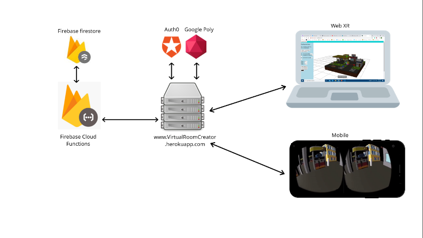
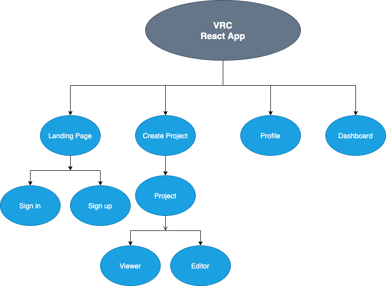
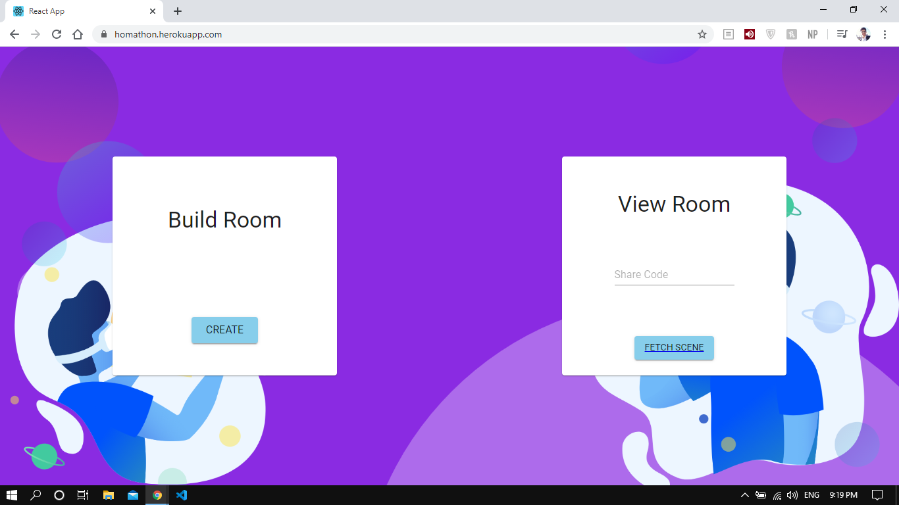
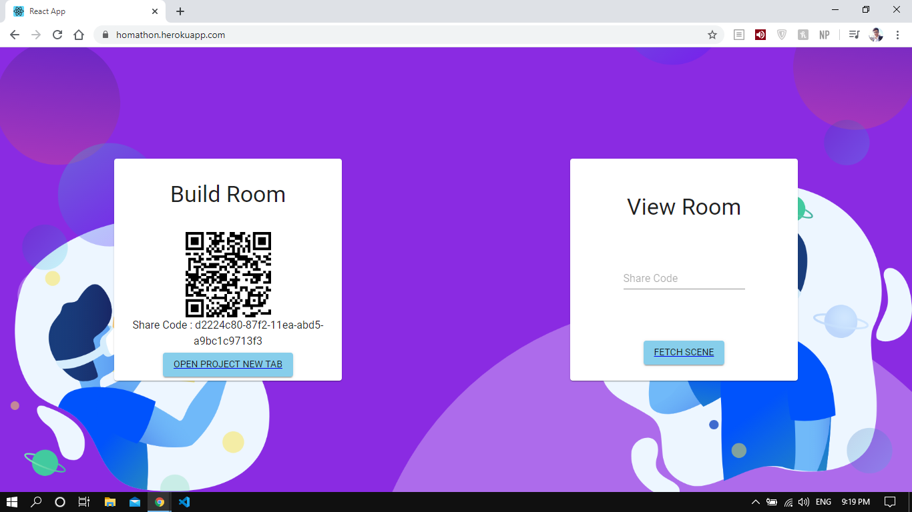

## Acknowledgement

First and foremost, we would like to thank Paul Henschel, the creator and project manager of numerous exceptional open-source projects and libraries, that makes WebXR development enjoyable, efficient, and most importantly accessible to developers.

## Idea

### Motivation

Technology is not just entertainment, and education does not need to be a chore. We believe that education should be fun. We aim to improve the quality of education by improving the interaction between students and educational content. Making the education process more engaging, entertaining, and efficient through a Virtual Reality(VR) [1]   Platform because the more senses that are involved in learning, the more efficient, easier, and more productive the learning process becomes.

Education + technology = the future.  
In a world where technology has the power to transform industries and offer entertainment to every dull moment we encounter, it’s time for educators to more whole-heartedly adopt some of these innovations. Not for the sole purpose of improving grades or cutting costs, but to offer students a more fulfilling educational experience. And, perhaps more importantly, to empower teachers to more effectively help struggling children while introducing innovation back into the classroom. 
Consider the difference in impact between teaching the wonders of history through a lifeless textbook or through an immersive virtual reality tour. It’s clear which one would be more effective, memorable, and entertaining.  

### Problem Definition 

Due to Covid-19, shifting to online education is imminent, conferencing platforms (e.g. Zoom) that are currently used aren't visually pleasing nor enjoyable enough. In Short, current online Education is boring and stressful 
Education is currently considered non-innovative and very repetitive and there is no existing platform to create interactive virtual rooms that are oriented towards education and teaching

### Objective

To create a user-friendly and effective tool that enables users to create interactive, content-rich, and easily shareable 3D rooms that can be tailored to the user's needs, for example:
 
It must enable teachers to creatively create and innovate new educational experiences related to their subject in the form of an easily sharable VR environment giving the students the chance to enjoy learning and improve their skills. 

Our Virtual Room Creator will make it affordable (as we don’t target a specific sector) to merge education with virtual reality

## Analysis and Design

### System Overview

VRC uses cloud computing architecture which comprises of two fundamental components, i.e. frontend and backend. The Frontend (React App) works as the client, presenting a user-friendly interface through which the user can use the system, it also communicates with the backend via Http Requests. Only the client-side (or frontend) is visible to the end-user. The frontend sends queries to the backend, which is implanted using firebase Cloud Functions, which is a server less framework that lets you automatically run backend code in response to events triggered by Firebase features and HTTPS requests. 

In this chapter, we will cover the functional and nonfunctional requirements of the system and offer a detailed description of the different processes and features offered by the system.
 

### System Components

- Front End Server: React App
- Firebase: Firebase cloud functions & Firebase Firestore
- Auth0 for authentication 
- Google poly API
- Continuous intergradation 
    - Heroko 
    - Github

### Navigation Layout

## Users & Functionality

### System Users

- Intended Users
    - Academic stuff
    - Teachers
    - Students
    - Parents
    - Content Creators
    - Interior/Exterior Designers
    - Product Marketers
    - Anyone needs to view/create a simulated environment that simulate a real one 

- <h4>User Characteristics</h4>

- For Creators:
    - knowledge about using computer and internet
    - knowledge about using browsers
    - knowledge of search, register and login to a website
    - knowledge about what is a virtual reality
    - knowledge of dealing with 3D objects and changing their properties

- For Viewer:
    - knowledge about using computer and internet 
    - knowledge about using browsers
    - knowledge of search, register and login to a website
    - knowledge about what is a virtual reality
    - knowledge about using smartphones and install applications
    - knowledge about how to run and operate a virtual reality scene in smartphone using VR device

- <h4>Functionality</h4>

- Creator Functionalities: 
    - Register or Login (if he already has account) using Facebook, google, or even email and password
    - Edit his/her personal Information
    - Create new project
    - Open and edit exiting project
    - Add multiple and different types of 3D Geometric model
    - Add multiple and different types of Lights
    - Add and upload Skybox images
    - Search for a google poly 3D objects by name or by category and add them to the project
    - Move or rotate any 3D object
    - Change any 3D object properties
    - Hide/show any 3D object added to the scene
    - Duplicate or delete any 3D object added to the scene
    - Change the size of the 3D object (make it bigger or smaller)
    - Zoom in/zoom out in the scene
    - Save the project.

- Viewer functionalities
    - Scan the project QR code directly using his smartphone camera
    - Or open the website from his/her smartphone and login (If he/she already has account) and then open project then click open viewer button
    - Put the smartphone that supports virtual reality in a VR device and enjoy the experience.

# Demo

Come on create your scene here: https://homathon.herokuapp.com/

    
    

    
    

## User Manual

